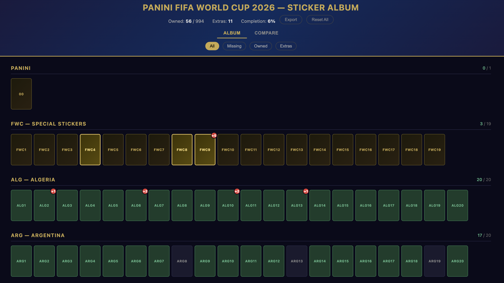
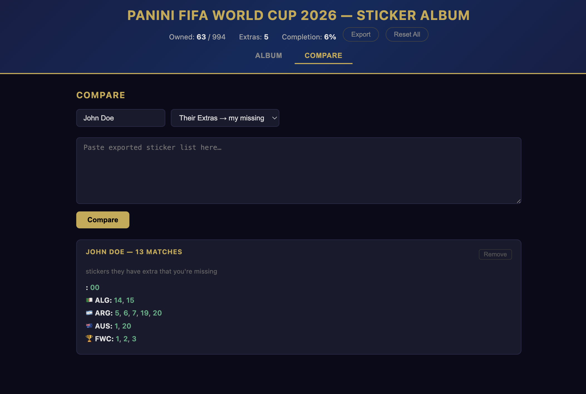

# Panini FIFA World Cup 2026 — Sticker Tracker

A personal web app to track your Panini sticker album. Mark stickers as owned, track duplicates, and compare lists with friends.

This is an unofficial fan-made tracker. It is not affiliated with, endorsed by, or sponsored by Panini, FIFA, or the FIFA World Cup.

---

## Features

- Track owned, missing, and duplicate stickers.
- See overall owned, missing, extras, completion, and completed-section counts.
- Navigate by section from fixed left and right progress lists.
- Hover a section to see its missing sticker numbers.
- Filter the album by all stickers, missing stickers, owned stickers, or extras.
- Export the current filtered view as a `.txt` list.
- Compare a friend's extras or missing list against your own collection.
- Switch the interface between English and Spanish.
- Choose from multiple dark and light color themes.
- Save all progress locally in plain JSON files.

---

## Preview

### Album Tracker



### Compare Lists



---

## Requirements

You need **Node.js 18 or newer** installed on your computer. If you're not sure whether you have it:

1. Open a terminal (on Mac: press `Cmd + Space`, type `Terminal`, press Enter)
2. Type this and press Enter:
   ```sh
   node --version
   ```
3. If you see version 18 or newer (like `v20.0.0`), you're good. If not, download Node.js from [nodejs.org](https://nodejs.org) and install it (choose the **LTS** version).

---

## Installation

1. Download or copy this project folder to your computer.

2. Open a terminal and navigate to the project folder:
   ```sh
   cd path/to/fwcAlbumApp
   ```
   *(Replace `path/to/fwcAlbumApp` with the actual path, e.g. `cd Documents/fwcAlbumApp`)*

3. Install dependencies:
   ```sh
   npm install
   ```
   You only need to do this once.

---

## Project Structure

```text
fwcAlbumApp/
├── public/
│   ├── index.html        # Page markup
│   ├── css/
│   │   └── styles.css    # Layout, themes, and sticker styling
│   └── js/
│       └── app.js        # Album data, state updates, filters, compare, language/theme logic
├── server.js         # Express server and JSON persistence endpoints
├── data/             # Local user data files ignored by git
│   ├── data.json     # Your sticker collection state
│   └── compare.json  # Saved compare results
└── README.md
```

The frontend is split by responsibility: HTML for structure, CSS for presentation, and JavaScript for behavior.

---

## Running the App

Start the server:
```sh
npm start
```

You should see:
```text
FWC 2026 Album running at http://localhost:3000
```

Open your browser and go to:
```text
http://localhost:3000
```

To stop the server, go back to the terminal and press `Ctrl + C`.

### Running in the background

If you want the server to keep running after you close the terminal, install **pm2**:
```sh
npm install -g pm2
```

Then manage the app with:
```sh
pm2 start server.js --name fwcAlbumApp    # start
pm2 stop fwcAlbumApp                      # stop
pm2 restart fwcAlbumApp                   # restart
pm2 startup                               # auto-start when your computer boots
```

---

## Usage

### Album tab

- **Click a sticker once** → turns green (you own it)
- **Click again** → a red badge appears showing `+1` (one duplicate)
- **Each additional click** → badge count increases (`+2`, `+3`, …)
- **Right-click a sticker** → removes one count (undo)

The top bar shows your overall progress:
- **Owned** — stickers you have
- **Missing** — stickers you still need
- **Extras** — duplicate stickers available for trades
- **Completion** — overall album percentage

The fixed section lists on the left and right show progress for Panini, FWC, each country, and Coca-Cola. Completed sections are highlighted. Click a section to jump to it, or hover over it to see a compact list of missing sticker numbers. If the section is complete, the hover popup shows `Complete!`.

Use the filter buttons to view:
- **All** — every sticker
- **Missing** — stickers you don't have yet
- **Owned** — stickers you have
- **Extras** — stickers you have duplicates of

Use the **Export** button to download the current view as a `.txt` file. The filter you have active determines what gets exported — for example, switch to *Extras* before exporting to share your duplicate list with a friend.

### Display settings

Use the controls in the bottom-right corner to customize the interface:

- **Language** — English or Spanish. Spanish also translates country names in the section lists and album headings.
- **Theme** — choose between Dark / Midnight Gold, Dark / Emerald, Dark / Ruby, Dark / Frost, Light / Daylight, Light / Mint, Light / Blush, and Light / Sage Cream.

These display settings are saved in your browser, so they persist when you reload the app on the same device.

### Compare tab

Use this to match lists with a friend — find out what you can trade.

1. Enter their **name** (optional, just for labeling)
2. Choose the mode:
   - **Their Extras → my missing** — paste their extras list to see which ones you still need
   - **Their Missing → my extras** — paste their missing list to see which ones you can give them
3. Paste their exported list into the text area
4. Click **Compare**

Results are saved and will still be there when you reload the page. Click **Remove** on any card to delete it.

---

## Your Data

All your progress is saved in `data/data.json`. Compare history is saved in `data/compare.json`. These are plain text files — you can open them, back them up, or copy them to another computer.

The `data/` folder is for local runtime data and is ignored by git, except for a small `data/.gitkeep` placeholder that keeps the folder in the project structure.

Language and theme settings are saved separately in your browser's `localStorage` as `fwc-language` and `fwc-theme`. They are per browser/device and are not stored in `data/data.json`.

Your data is **not** stored in the cloud. It lives entirely on your machine.

### Importing an existing list

If you already have your sticker list written down somewhere (paper, spreadsheet, photos, etc.), you can use an AI tool like ChatGPT, Claude, or Gemini to convert it into the right format. Use this prompt:

---

> I have a Panini FIFA World Cup 2026 sticker album tracker app. I need you to convert my sticker list into a specific JSON format.
>
> **Target format:**
> ```json
> { "ARG1": 1, "ARG5": 1, "MEX3": 2, "FRA7": 3 }
> ```
>
> Rules:
> - Key = sticker ID (country code prefix + number, e.g. `ARG1`, `MEX3`, `FWC5`, `CC2`, `00`)
> - Value = total count: `1` means I own it, `2` means I own it and have 1 extra, `3` means 2 extras, and so on
> - Only include stickers I own (value ≥ 1). Omit everything I'm missing
> - Valid prefixes: `00` (Panini logo), `FWC1`–`FWC19` (special), `CC1`–`CC14` (Coca-Cola), and these team codes: ALG ARG AUS AUT BEL BIH BRA CAN CPV COL CRO CUW CZE COD ECU EGY ENG FRA GER GHA HAI IRN IRQ JPN JOR MAR MEX NED NZL NOR PAN PAR POR QAT KSA SCO SEN RSA KOR ESP SWE SUI TUN TUR USA URU UZB (each 1–20)
>
> **My list:**
> [paste your list here in whatever format you have it]
>
> Return only the raw JSON object, no explanation.

---

Once you get the JSON back, save it as `data/data.json` in the app folder (replacing the existing file if there is one), then reload the app in your browser.
